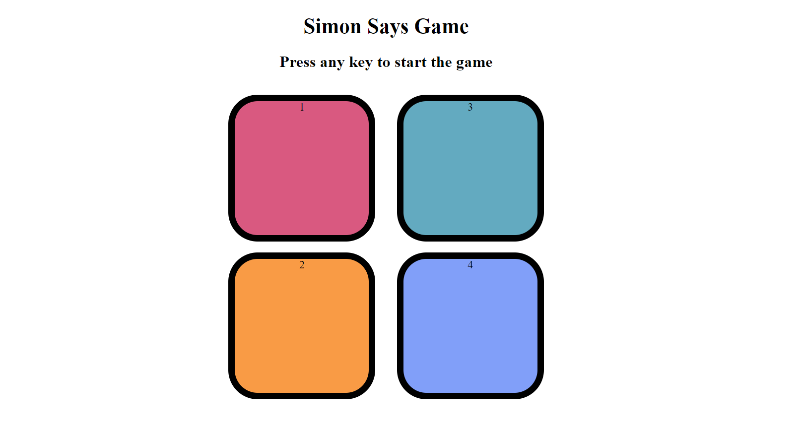

# Simon-Says-Game
The Simon Says game is an electronic memory game where players must repeat an increasingly long sequence of lights and sounds in the correct order. This project was built using HTML, CSS, and JavaScript to create an interactive and visually engaging user experience.

